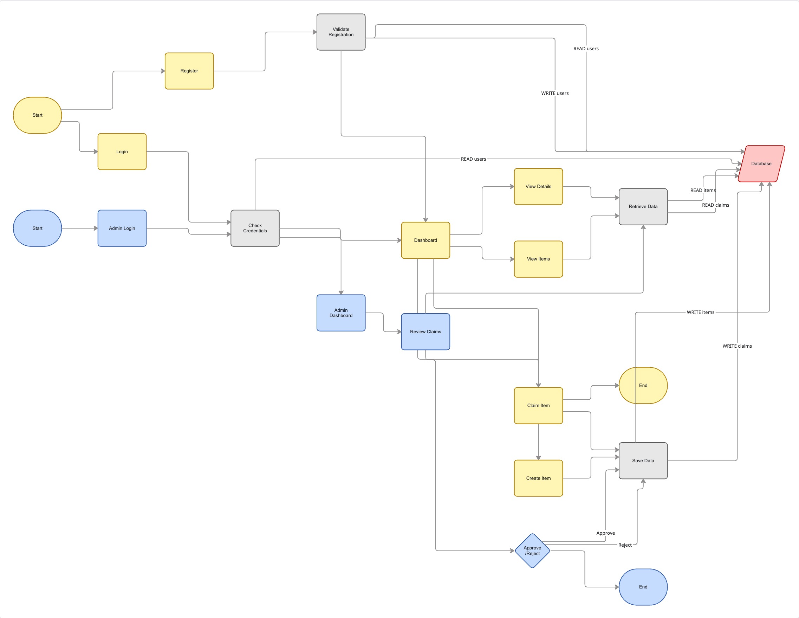
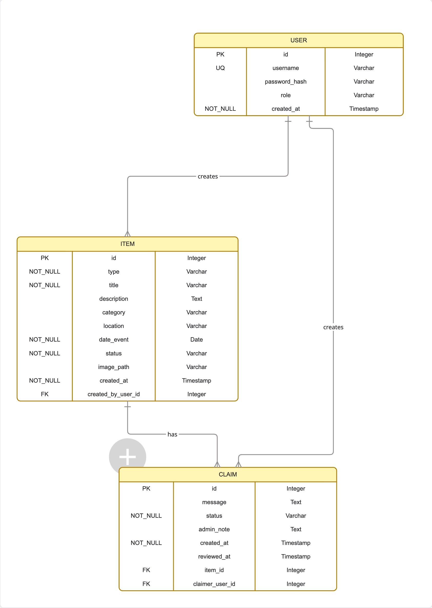

{: .label }
[Jane Dane]

{: .no_toc }
# Data model

{: .text-delta }

Table of contents

+ ToC
{: toc }

## Tabellen im Detail

---

## Users

Die **Users-Tabelle** speichert alle registrierten Benutzer der Anwendung.
Es gibt zwei Benutzertypen: **Studenten** und **Administratoren**.

**Spalten:**

- `id` (INTEGER PRIMARY KEY AUTOINCREMENT)  
  Eindeutige Benutzer-ID (Primärschlüssel)

- `username` (TEXT UNIQUE NOT NULL)  
  Benutzername für den Login

- `password` (TEXT NOT NULL)  
  Passwort zur Authentifizierung (im Projekt unverschlüsselt gespeichert)

- `is_admin` (BOOLEAN DEFAULT 0)  
  Kennzeichnet, ob der Benutzer Administrator ist

- `matriculation_number` (TEXT UNIQUE)  
  Matrikelnummer zur eindeutigen Identifikation von Studenten

- `email` (TEXT UNIQUE)  
  Hochschul-E-Mail-Adresse des Benutzers

**Beziehungen:**

- Ein User kann mehrere **ItemPosts** erstellen  
- Ein User kann mehrere **PostInterests** (Mitteilungen) verfassen

---

## ItemPosts

Die **ItemPosts-Tabelle** speichert alle gemeldeten verlorenen oder gefundenen Gegenstände.

**Spalten:**

- `id` (INTEGER PRIMARY KEY AUTOINCREMENT)  
  Eindeutige ID des Beitrags

- `post_type` (TEXT NOT NULL)  
  Art des Beitrags (`lost` oder `found`)

- `title` (TEXT NOT NULL)  
  Kurzer Titel des Gegenstands

- `description` (TEXT NOT NULL)  
  Detaillierte Beschreibung des Gegenstands

- `location` (TEXT)  
  Fund- oder Verlustort des Gegenstands

- `status` (TEXT DEFAULT 'open')  
  Status des Beitrags (`open`, `claimed`, `closed`)

- `created_by` (INTEGER NOT NULL)  
  Fremdschlüssel zum User, der den Beitrag erstellt hat

- `created_at` (TIMESTAMP DEFAULT CURRENT_TIMESTAMP)  
  Zeitpunkt der Erstellung des Beitrags

**Beziehungen:**

- Ein ItemPost gehört zu genau **einem User**
- Ein ItemPost kann **mehrere PostInterests** haben

---

## PostInterests

Die **PostInterests-Tabelle** speichert Mitteilungen von Benutzern, die sich auf einen Gegenstand melden.

**Spalten:**

- `id` (INTEGER PRIMARY KEY AUTOINCREMENT)  
  Eindeutige ID der Mitteilung

- `post_id` (INTEGER NOT NULL)  
  Fremdschlüssel zum ItemPost, auf den sich die Mitteilung bezieht

- `user_id` (INTEGER NOT NULL)  
  Fremdschlüssel zum User, der die Mitteilung verfasst hat

- `message` (TEXT)  
  Optionaler Nachrichtentext

- `created_at` (TIMESTAMP DEFAULT CURRENT_TIMESTAMP)  
  Zeitpunkt der Mitteilung

**Beziehungen:**

- Eine Mitteilung gehört zu genau **einem ItemPost**
- Eine Mitteilung gehört zu genau **einem User**
- Ein ItemPost kann **mehrere Mitteilungen** haben

---

## AppSettings

Die **AppSettings-Tabelle** speichert globale Konfigurationen der Anwendung.
Sie enthält in der Regel **nur einen Datensatz** (Singleton).

**Spalten:**

- `id` (INTEGER PRIMARY KEY AUTOINCREMENT)  
  Eindeutige ID des Settings-Datensatzes

- `station_name` (TEXT)  
  Name der Lost-&-Found-Station

- `contact_email` (TEXT)  
  Offizielle Kontakt-E-Mail-Adresse der Fundstelle

**Beziehungen:**

- Keine direkten Fremdschlüssel
- Wird systemweit von Admins verwaltet

---

## Zusammenfassung der Beziehungen

- **User ↔ ItemPosts**  
  1:n – Ein Benutzer kann mehrere Beiträge erstellen

- **ItemPosts ↔ PostInterests**  
  1:n – Ein Beitrag kann mehrere Mitteilungen haben

- **User ↔ PostInterests**  
  1:n – Ein Benutzer kann mehrere Mitteilungen verfassen

- **AppSettings**  
  Singleton – globale Konfiguration ohne direkte Abhängigkeiten

